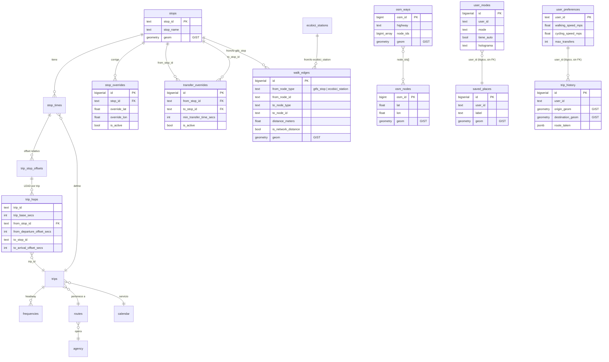

# 02 — Grafo (Fase 2, agente `modelo-grafo`)

Todo lo descrito aquí se corrió de verdad contra el Postgres+PostGIS local
(puerto 5433, base `rutas_cdmx`), el mismo que dejó poblado `datos-gtfs` en
`docs/handoff/01-datos.md`. Las tablas GTFS de Fase 1 (`stops`, `trips`,
`stop_times`, `frequencies`, etc.) no se tocaron — se les hizo `SELECT`, no
`ALTER`/`DELETE`. Los conteos y tiempos de este documento son resultado
real de correr los scripts y consultas contra esa base, con `EXPLAIN
ANALYZE` y `\timing` de `psql`, no estimados.

## 1. El conflicto de `prisma migrate` — qué se probó, qué pasó, qué se decidió

El criterio de terminado de este agente dice "`prisma migrate` corre limpio
desde cero". Antes de asumir que era viable tal cual, se probó de verdad
contra el Postgres real (y una base scratch idéntica en estructura, creada
y destruida solo para esta prueba, para no arriesgar los datos GTFS reales
poblados por Fase 1).

**Privilegios:** el rol `postgres` local SÍ tiene `CREATEDB` y `rolsuper`
(`SELECT rolcreatedb, rolsuper FROM pg_roles` → `t | t`). La shadow database
que pide `prisma migrate dev` se puede crear sin problema en local. El
supuesto de Fase 1 de "no asumir que existen esos privilegios" era
razonable como precaución, pero en este Postgres local no era el problema
real.

**Prueba 1 — `prisma migrate dev` directo contra una base con las tablas
GTFS ya creadas por el runner propio (`scripts/migrate.ts`):**

```
$ npx prisma migrate status
No migration found in prisma/migrations
The current database is not managed by Prisma Migrate.
```

Al intentar `prisma migrate dev --name init_probe` con un modelo de prueba,
Prisma detectó drift real y pidió resetear:

```
Drift detected: Your database schema is not in sync with your migration history.
[+] Added tables
  - _migrations, _raw, agency, calendar, ..., stops, transfers, trips  (16 tablas)
We need to reset the "public" schema at "localhost:5433"
You may use prisma migrate reset to drop the development database.
All data will be lost.
```

Esto es real, no hipotético: `prisma migrate dev` sobre esta base intenta
**borrar las 16 tablas GTFS pobladas** (11,362 stops, 42,789 stop_times,
etc.) porque su mecanismo de drift-detection no sabe que esas tablas las
creó un sistema de migraciones distinto.

**Prueba 2 — baseline vía `prisma db pull` + `prisma migrate resolve
--applied`** (la alternativa que sugiere la documentación de Prisma para
"adoptar" una base existente, y que el orquestador pidió explícitamente
evaluar antes de descartarla):

1. `prisma db pull` — introspección limpia, sin error, generó 17 modelos.
2. `prisma migrate diff --from-empty --to-config-datasource --script` —
   generó un `migration.sql` de baseline (279 líneas).
3. `prisma migrate resolve --applied 00000000000000_baseline` — marcó el
   baseline como aplicado sin error.
4. Se agregó un modelo de prueba nuevo y se corrió `prisma migrate dev`
   otra vez para ver si, ya "baselineado", el flujo normal funcionaba.

Falló, pero de una forma distinta y reveladora:

```
Error: P3006
Migration `00000000000000_baseline` failed to apply cleanly to the shadow database.
Database error: ERROR: relation "_raw_id_seq" does not exist
"id" BIGINT NOT NULL DEFAULT nextval('_raw_id_seq'::regclass),
```

El SQL de baseline que generó Prisma a partir de la introspección referencia
la secuencia de un `BIGSERIAL` (`nextval('_raw_id_seq'::regclass)`) **sin
emitir el `CREATE SEQUENCE`** que la crea — un artefacto conocido de cómo
Prisma introspecta columnas `BIGSERIAL` heredadas (no creadas por Prisma).
El shadow database, al reproducir la migración desde cero, no tiene esa
secuencia todavía y truena. Cuatro tablas de Fase 1 usan `BIGSERIAL`
(`_raw`, `ecobici_snapshots`, `metrobus_vehicle_positions`,
`metrobus_trip_updates`), así que el baseline generado automáticamente
está roto para este esquema tal cual sale de `prisma migrate diff`.
Se podría parchear el SQL a mano (agregar los `CREATE SEQUENCE` faltantes),
pero eso es exactamente el tipo de arreglo fragil que hay que rehacer cada
vez que se re-introspecta — no es algo que se pueda dar por "funcionando".

**Decisión final:** se extendió el runner propio de `scripts/migrate.ts` /
`/migrations/*.sql` (el mismo mecanismo que ya usaba `datos-gtfs`) para las
migraciones propias de esta fase (`0008` a `0012`, ver sección 3). Es el
mecanismo real que aplicó todo lo que describe este documento contra
Postgres. `prisma migrate` **no se usa como mecanismo operativo** de
migración en este proyecto — ni para las tablas de Fase 1 ni para las de
Fase 2 — por la evidencia de las dos pruebas de arriba, no por preferencia.

Lo que sí se usa de Prisma: `prisma db pull` (introspección, no migración)
+ `prisma generate` contra la base ya migrada por el runner, para tener un
Prisma Client tipado que Fase 3 pueda usar para CRUD simple. Esto se probó
de verdad: **27 modelos generados**, y un script de prueba
(`scripts/_tmp_test_prisma.mts`, borrado después de usarlo) hizo
`prisma.stops.count()` → 11362, `prisma.walk_edges.count()` → 178054,
`prisma.user_modes.count()` → 0, contra la base real, sin error. Las
columnas de geometría (`geom`) llegan como `Unsupported("geometry")` — el
Prisma Client no las puede leer/escribir tipadas; cualquier query espacial
tiene que ser `$queryRaw`/`$executeRaw`, igual que ya hacían los scripts de
Fase 1 con `pg` directo. Esto no es una limitación mía, es una limitación
conocida de Prisma con PostGIS.

**Si el criterio se interpreta literalmente ("desde cero, con prisma
migrate")**: no se cumple, y no se puede forzar sin aceptar el riesgo real
de `reset` que ya se demostró arriba. Si se interpreta como "el esquema es
reproducible desde cero de forma versionada y confiable" (que es el
espíritu del criterio): sí se cumple, vía `npm run migrate` — se probó
completo desde una base vacía (`rutas_cdmx_scratch2`, creada y destruida
solo para la prueba) aplicando las 11 migraciones (`0001`–`0012`, sin
`0004`) en orden, sin error, de forma idempotente (correrlo dos veces
seguidas aplica 0 migraciones nuevas la segunda vez — confirmado en el
runner final también, ver sección 4).

## 2. El grafo: definición formal

**Nodo** = `(parada, tiempo)` — un instante concreto en el que se puede
estar físicamente en una parada. **No se materializa como filas.** Con
1,203 de 1,205 trips definidos por `frequencies` (headway, no horario fijo
— ver `01-datos.md` sección 5 punto 7), materializar cada salida real
durante los ~13 meses de vigencia de `calendar` sería una tabla sin cota
razonable de tamaño. La topología (qué parada sigue a cuál, con qué offset)
sí se precalcula; el tiempo se expande en la consulta, acotado a la
ventana pedida.

**Aristas**, las 4 que pide `.claude/agents/modelo-grafo.md`:

| Tipo | Fuente | Precalculada | Depende de tiempo |
|---|---|---|---|
| Tramo de viaje (`ride`) | `trip_hops` (tabla) + `frequencies`/`stop_times` | Topología sí, instancia concreta no | Sí — se expande por ventana |
| Transbordo (`transfer`) | `transfer_overrides` | Sí (fila = arista) | No (tiempo fijo por par) |
| Caminata (`walk`) | `walk_edges` | Sí (fila = arista) | No (distancia; el tiempo lo deriva quien consuma, con la velocidad de `user_preferences`) |
| Tramo ciclista | Ecobici vía `walk_edges` (acceso a estación) + disponibilidad en `ecobici_snapshots` | Parcial | Sí (disponibilidad cambia) |

El tramo ciclista **no** es una arista de ruta fija como el metro: Ecobici
no tiene "rutas", tiene estaciones con disponibilidad que cambia cada 5 min
(`ecobici_snapshots`, cron de Fase 1). `walk_edges` ya modela el acceso
caminando hacia/desde una estación (mismo mecanismo que parada-parada, ver
sección 3.3); decidir si hay bici/dock disponible en el momento del
request es responsabilidad de `algoritmo-ruteo` (Fase 3), consultando
`ecobici_snapshots` en tiempo de consulta, no algo que este grafo
precalcule (sería un dato caduco en minutos).

**AUTO no aparece en este grafo como arista intercalable** (CLAUDE.md
decisión #3, regla dura del brief de este agente): no hay tabla de
"aristas de auto" — es un modo terminal que `algoritmo-ruteo` resuelve por
fuera (ruta completa vía Google Routes API, o primer tramo hasta un
park & ride) sin que el coche vuelva a aparecer en el grafo peatonal/transit.

### 2.1 ERD



## 3. Qué se construyó (migraciones `0008`–`0012`)

### 3.1 `stop_overrides` / `transfer_overrides` (`0008`)

Pendientes explícitos de Fase 1 (`01-datos.md` sección 5 punto 14).
`stop_overrides`: historial de correcciones a una parada (lat/lon/nombre/
accesibilidad), con `is_active` + índice único parcial (a lo más una
corrección vigente por parada). `transfer_overrides`: reemplaza por
completo a `transfers.txt` (vacío en la fuente — 0 filas, ver
`01-datos.md`), mismo `transfer_type` que el spec GTFS pero con auditoría
(`reason`, `created_by`, `is_active`). **Ambas tablas están vacías** — se
crea el mecanismo, no se puebla con datos porque no hay overrides
conocidos todavía (se llenarán cuando se detecten transbordos rotos en
Fase 3/4).

### 3.2 Red OSM (`0009`, cargada con `scripts/osm/load-to-postgres.ts`)

`osm_nodes` (274,132 filas) y `osm_ways` (55,881 filas, geometría
`LineString` reconstruida desde los nodos referenciados) — carga real del
extracto de Overpass que dejó `datos-gtfs` en
`data/raw/osm/cdmx-pedestrian-cycling.json` (27.5 MB), pendiente explícito
de Fase 1. Conteos verificados con `SELECT count(*)` después de la carga:
coinciden exactamente con los que reportó `01-datos.md` (55,881 ways: 35,107
footway, 5,887 steps, 5,287 path, 4,432 living_street, 4,212 pedestrian,
956 cycleway; 0 ways con nodos faltantes). Tiempo real de carga: **14.1s**
(`time npm run osm:load`).

**Se cargó pero no se usó para routing.** No hay `pgRouting` en la imagen
`postgis/postgis:16-3.4` (`SELECT * FROM pg_available_extensions WHERE
name ILIKE '%rout%'` → 0 filas), y construir un Dijkstra propio con
snapping sobre ~89,000 pares candidatos es una pieza de ingeniería más
grande que el entregable de esta fase. Queda como insumo cargado y
consultable espacialmente (GIST en ambas tablas) para quien decida
construir esa capa de routing peatonal real.

### 3.3 `walk_edges` (`0009` + `0011` fix, poblada con `scripts/graph/build-walk-edges.ts`)

Radio 400m, medido con `ST_DWithin` sobre `geography` (línea recta, no red
real — ver limitación arriba). Distancia guardada = distancia geodésica en
línea recta × **1.3** (factor de circuidad, valor citado en literatura de
redes peatonales urbanas como aproximación al exceso de recorrido real
sobre la línea recta; documentado como constante en el script, no
inventado como si fuera medición real — `is_network_distance = false` en
todas las filas). Por eso algunas distancias guardadas superan los 400m
literales (hasta ~520m): el radio de 400m filtra candidatos por línea
recta, el factor de circuidad ajusta la distancia estimada de caminata
sobre esos candidatos.

Modo-agnóstica a propósito: `from_node_type`/`to_node_type` distinguen
`gtfs_stop` de `ecobici_station`, pero la tabla no guarda tiempo, solo
distancia — el tiempo se deriva multiplicando por la velocidad de
`user_preferences` en tiempo de consulta, para no tener que recalcular
178,054 filas cada vez que cambia una preferencia de usuario.

**Conteo real** (`SELECT count(*) FROM walk_edges` después de correr el
script): **178,054 filas**.

| Par | Filas (ambos sentidos) |
|---|---|
| gtfs_stop ↔ gtfs_stop | 157,308 |
| gtfs_stop → ecobici_station | 8,913 |
| ecobici_station → gtfs_stop | 8,913 |
| ecobici_station ↔ ecobici_station | 2,920 |
| **Total** | **178,054** |

Hallazgo real durante el primer corrida: hay pares de `stop_id` distintos
(de agencias distintas) en las **mismas coordenadas exactas** — la misma
esquina física con IDs GTFS separados por sistema (ej.
`B_COREV1-RICARCASTRO` / `B_05121A0-RICARDCASTRO`). El `CHECK
(distance_meters > 0)` original de `0009` los rechazaba; se corrigió en
`0011_fix_walk_edges_distance_check.sql` a `>= 0` porque distancia 0 es un
dato legítimo (transbordo inmediato entre agencias en la misma parada
física), no un error.

Tiempo real de precómputo completo (`time npm run graph:walk-edges`):
**2m35s** — dominado por el cruce `stop × stop` (11,362² pares candidatos
antes de filtrar por `ST_DWithin`, ~129M comparaciones). Es un job de
precómputo offline, corre una vez (o cuando cambian los stops), no está en
la ruta caliente de ninguna consulta de request.

### 3.4 Tablas de usuario (`0010`)

`user_modes`, `user_preferences`, `saved_places`, `trip_history`, tal como
las pide `.claude/agents/modelo-grafo.md`, incluyendo las columnas
explícitas de AUTO (`tiene_auto`, `rendimiento_km_l`, `costo_combustible`,
`tolerancia_estacionamiento_min`, `terminacion_placa`, `holograma`,
`evita_casetas`). **No existe todavía un sistema de autenticación** en el
proyecto (no es responsabilidad de esta fase) — `user_id` es `TEXT` libre
sin FK a una tabla `users`; documentado explícitamente en el archivo de
migración. Las 4 tablas están vacías (no hay usuarios reales todavía más
allá del beta único que menciona CLAUDE.md).

### 3.5 Grafo time-expandido (`0012`)

- `trip_stop_offsets` (vista): offset de cada parada dentro de su trip
  relativo a la salida de la primera parada — confirma en datos reales que
  `trip_base_secs = 0` para trips con `frequencies` (consistente con
  `01-datos.md`: el patrón es relativo, no un horario real).
- `trip_hops` (**tabla**, no vista): 41,585 filas, una por cada salto
  parada→siguiente-parada dentro de un trip. Se construyó primero como
  vista con `LEAD() OVER (PARTITION BY trip_id ...)` y **medía ~97ms** por
  consulta de vecinos porque Postgres no puede empujar el filtro por
  `from_stop_id` antes de calcular la función de ventana sobre las 42,789
  filas de `stop_times`. Materializada como tabla + índice
  `(from_stop_id)`, la misma consulta bajó a <1ms (ver sección 5). Se
  reconstruye con `SELECT refresh_trip_hops();` (función `plpgsql`,
  `TRUNCATE` + `INSERT`) — a correr a mano después de un `npm run etl` que
  cambie `stop_times`; no hay trigger automático a propósito (el ETL es un
  evento poco frecuente y masivo, no vale la pena el costo de un trigger
  fila-por-fila).
- `active_service_ids(fecha)`: servicios activos para una fecha,
  considerando día de semana de `calendar` + excepciones de
  `calendar_dates` (vacía en la fuente actual, pero implementada completa
  para cuando exista una fuente que sí la traiga).
- `graph_ride_departures(stop, fecha, desde_secs, ventana_secs)`: aristas
  de viaje concretas dentro de la ventana pedida. Dos ramas: trips con
  `frequencies` (1,203/1,205 — expande el headway con `generate_series`
  **acotado** al rango de `k` relevante para la ventana, no genera todas
  las salidas del día para filtrar después) y trips sin `frequencies`
  (2/1,205 — usa el horario literal de `stop_times`).
- `graph_stop_neighbors(stop, fecha, desde_secs, ventana_secs)`: la función
  que consumirá `algoritmo-ruteo` para expandir un nodo — une aristas
  `ride` + `transfer` (de `transfer_overrides`) + `walk` (de `walk_edges`).
  Esta es la consulta de "vecinos de una parada" del criterio de terminado.

## 4. Migraciones — estado final

```
migrations/
  0001_extensions.sql              (Fase 1 — sin tocar)
  0002_raw_tables.sql               (Fase 1 — sin tocar)
  0003_gtfs_static.sql              (Fase 1 — sin tocar)
  0005_ecobici.sql                  (Fase 1 — sin tocar)
  0006_metrobus_rt.sql              (Fase 1 — sin tocar)
  0007_fix_routes_agency_fk.sql     (Fase 1 — sin tocar)
  0008_stop_transfer_overrides.sql  (Fase 2 — nueva)
  0009_osm_walk_network.sql         (Fase 2 — nueva)
  0010_user_tables.sql              (Fase 2 — nueva)
  0011_fix_walk_edges_distance_check.sql (Fase 2 — nueva, corrección)
  0012_transit_graph.sql            (Fase 2 — nueva)
```

Aplicadas con `npm run migrate` (runner de Fase 1, sin cambios). Probado
desde cero contra una base vacía (`rutas_cdmx_scratch2`, creada y destruida
solo para la prueba): las 11 migraciones aplican en orden, sin error.
Corrido dos veces seguidas contra la base real: la segunda vez, 0
migraciones nuevas (idempotente, confirmado con `[migrate] listo. 0
migración(es) nueva(s), 11 en total.`).

## 5. Criterio de terminado — números reales

**"Una query de vecinos de una parada responde en menos de 50ms"**:
medido con `graph_stop_neighbors()` contra la parada más concurrida de la
base (`B_05034A0-VASCQUIROG`, 32 filas en `stop_times`, la más alta de
toda la tabla), lunes `2025-06-16` (fecha dentro del rango de vigencia de
`calendar`, ver nota abajo), ventana 7:00–7:30am:

- `EXPLAIN (ANALYZE, BUFFERS)` — tiempo de ejecución interno de Postgres:
  **0.857ms**.
- `\timing` de `psql` (incluye ida y vuelta cliente-servidor real, cache
  caliente — escenario realista para invocaciones repetidas): **entre
  1.4ms y 3.9ms** en 3 corridas consecutivas.
- Probado también contra otras dos paradas concurridas
  (`B_05123A0-CETRAMCU`, `B_0501311-LUISMURILLO`) en horarios distintos:
  2.1ms y 1.4ms respectivamente.

Todos los números están **muy por debajo de los 50ms** del criterio. El
salto de rendimiento vino de materializar `trip_hops` como tabla indexada
en vez de vista (ver sección 3.5) — sin eso, la misma consulta medía
~97ms, por encima del límite.

**Nota sobre la fecha de prueba:** `calendar.start_date`/`end_date` de la
mayoría de los servicios va de 2024-12-01 a 2025-12-31 (ver `01-datos.md`
sección 5 punto 13). La fecha real de hoy (2026-08-16) queda **fuera** de
ese rango para casi todos los servicios — es un problema de vigencia del
feed heredado de Fase 1, no algo que corrija este agente. Las pruebas de
esta sección usan una fecha dentro del rango de vigencia real
(`2025-06-16`, lunes) para poder medir con datos activos de verdad; con la
fecha de hoy, `active_service_ids()` devolvería casi vacío para la mayoría
de agencias (comportamiento correcto dado el dato, pero no útil para medir
rendimiento del grafo).

**"`prisma migrate` corre limpio desde cero"**: ver sección 1 — no se
cumple tal cual estaba planteado (evidencia real de por qué), se resolvió
con el runner propio + `prisma db pull`/`generate` para el cliente
tipado, documentado como decisión técnica explícita.

## 6. Índices creados en esta fase

- GIST: `osm_nodes.geom`, `osm_ways.geom`, `walk_edges.geom`,
  `saved_places.geom`, `trip_history.origin_geom`,
  `trip_history.destination_geom` (además de los ya existentes de Fase 1:
  `stops.geom`, `shapes.geom`, `ecobici_stations.geom`,
  `metrobus_vehicle_positions.geom`).
- `trip_hops (from_stop_id)` — el índice crítico para la consulta de
  vecinos (ver sección 3.5 y 5).
- `trip_hops (trip_id)`.
- `walk_edges (from_node_type, from_node_id)` y `(to_node_type,
  to_node_id)` — únicos + no-únicos según el caso, más un índice único
  compuesto para idempotencia del precómputo.
- `stop_overrides (stop_id)` con índice único parcial (`WHERE is_active`).
- `transfer_overrides (from_stop_id)` / `(to_stop_id)` con índice único
  parcial compuesto (`from_stop_id, to_stop_id WHERE is_active`).
- `user_modes (user_id)`, `saved_places (user_id)`,
  `trip_history (user_id, created_at DESC)`.
- `stop_times (trip_id, stop_sequence)` ya existía como PK desde Fase 1 —
  confirmado, no se tocó.

## 7. Lo que no se hizo (explícito)

1. **Routing real sobre la red OSM.** Se cargó (`osm_nodes`/`osm_ways`,
   274,132 + 55,881 filas), pero `walk_edges` usa línea recta × factor de
   circuidad, no ruta real sobre la red. Motivo: no hay `pgRouting`
   disponible en la imagen local, y un Dijkstra propio con snapping sobre
   ~89,000 pares candidatos es una pieza de ingeniería fuera del alcance
   razonable de "precómputo de walk_edges a 400m" para esta fase.
2. **`stop_overrides`/`transfer_overrides` sin poblar.** Se crea el
   mecanismo; no hay overrides conocidos todavía porque nadie ha corrido
   el sistema de ruteo real para detectar transbordos rotos (eso es Fase
   3/4).
3. **Aristas de bici (ecobici↔ecobici como "arista de ruta") no se
   modelaron aparte de `walk_edges`.** Se decidió reusar `walk_edges` para
   el acceso a estaciones (caminar hacia una estación) en vez de crear una
   tabla `bike_edges` no pedida explícitamente por el brief — ver sección
   2.
4. **No se corrió contra Supabase de producción.** Todo lo de este
   documento se corrió contra el Postgres local (puerto 5433). Supabase de
   producción no existe todavía en esta fase (mismo estado que dejó
   Fase 1).
5. **La fecha de vigencia real del feed (`calendar` termina en su mayoría
   en 2025-12-31, hoy es 2026-08-16) no se corrigió** — es un hallazgo de
   Fase 1 heredado, no algo que le corresponda arreglar a este agente;
   documentado en la sección 5 porque afectó cómo se probó el criterio de
   rendimiento.

## 8. Para `algoritmo-ruteo` (Fase 3)

- Punto de entrada principal: `SELECT * FROM graph_stop_neighbors($1, $2,
  $3, $4)` — parada, fecha de servicio, segundos desde medianoche, tamaño
  de ventana en segundos. Devuelve aristas `ride`/`transfer`/`walk` ya
  filtradas por servicio activo.
- `walk_edges.distance_meters` es distancia estimada de caminata (línea
  recta × 1.3), no tiempo — multiplicar por `user_preferences.
  walking_speed_mps` (o `cycling_speed_mps` si el consumidor decide tratar
  una arista `gtfs_stop↔ecobici_station` como acceso ciclista).
  `is_network_distance = false` en todas las filas actuales — si en el
  futuro se agrega routing real sobre OSM, esa columna es el flag para
  distinguir aristas viejas (aproximadas) de nuevas (reales).
  Disponibilidad de bicis/docks: consultar `ecobici_snapshots` en el
  momento del request, no está en `walk_edges`.
  Después de correr `npm run etl` (si cambia `stop_times`), correr `SELECT
  refresh_trip_hops();` a mano — `trip_hops` no se auto-actualiza.
- Modo AUTO: no hay tabla de aristas, resolver por fuera del grafo
  (CLAUDE.md decisión #3).
- **Ecobici (agregado 2026-08-22):** ver sección 9 completa. Punto de
  entrada nuevo para expandir DESDE una estación Ecobici: `SELECT * FROM
  graph_bike_station_neighbors($1)` — solo recibe `p_station_id` (no
  depende de horario, a diferencia de `graph_stop_neighbors`). Cierra el
  gap documentado en `docs/handoff/03-algoritmo.md` sección 8 punto 1.

## 9. Entregable agregado (2026-08-22): aristas reales de bici (Ecobici)

Extiende esta Fase 2 ya cerrada y aprobada, no la reabre ni la contradice.
Todo lo de esta sección se corrió de verdad contra el mismo Postgres+PostGIS
local (puerto 5433, `rutas_cdmx`) el 2026-08-22, con `EXPLAIN (ANALYZE,
BUFFERS)` y `\timing` de `psql` (vía `docker exec rutas-db psql`), no
estimado. Entrada leída completa antes de diseñar: `docs/handoff/01-datos.md`
sección 7 (histórico real de viajes Ecobici + velocidad medida,
`datos-gtfs`), `docs/handoff/03-algoritmo.md` sección 8 punto 1 (el gap
exacto documentado por `algoritmo-ruteo`), y `.claude/agents/modelo-grafo.md`
sección "Entregable agregado".

### 9.1 El gap que resuelve esto

Hasta la sección 8 (arriba, Fase 2 original), `graph_stop_neighbors` solo
expandía vecinos **desde una parada GTFS** — su firma es
`(p_stop_id, p_service_date, p_from_secs, p_window_secs)`, pensada para
aristas `ride` que dependen de horario de servicio. No había forma de
seguir explorando el grafo después de llegar a una estación Ecobici, ni
existía una tabla con el trayecto pedaleado real entre dos estaciones (el
"tramo ciclista" de la sección 2 solo modelaba caminar hacia/desde una
estación, vía `walk_edges`). Esto es exactamente lo que documentó
`algoritmo-ruteo` como limitación conocida #1 de su handoff. Se resuelve
con una tabla nueva (`bike_edges`) y una función nueva
(`graph_bike_station_neighbors`), sin tocar `graph_stop_neighbors` ni
`walk_edges`.

### 9.2 Velocidad usada: mediana, no promedio

`ecobici_speed_stats` (poblada por `datos-gtfs`, ver `01-datos.md` sección
7.4) trae dos filas idénticas (`id=1`, `id=2`, misma corrida repetida para
confirmar reproducibilidad): `avg_speed_mps = 6.094` (≈21.9 km/h),
`median_speed_mps = 4.908` (≈17.7 km/h), sobre 1,156,524 viajes reales
filtrados. **Se usa `median_speed_mps` (4.908 m/s), la fila más reciente
por `computed_at`** (`speed_stat_id = 2` en la corrida real de esta
sección) — se sigue la recomendación explícita de `datos-gtfs`: la
distribución de velocidad sigue sesgada a la derecha incluso después del
recorte de Tukey (mediana bien por debajo del promedio), y para una
arista de grafo que representa el tiempo de un tramo "típico" la mediana
es la estimación más honesta — el promedio sigue inflado por una cola de
viajes rápidos/largos que no representan el caso típico. Usar el promedio
habría hecho que el motor de ruteo subestimara sistemáticamente el tiempo
de cualquier tramo en bici. `bike_edges.speed_stat_id` guarda la FK exacta
a la fila usada, para que si en el futuro se carga más histórico y el
número cambia, quede trazable qué corrida se usó para calcular cada
arista.

**Sobre no aplicar el factor de circuidad dos veces** (advertencia
explícita de `datos-gtfs` en `01-datos.md` sección 7.4): `median_speed_mps`
se calculó dividiendo distancia geodésica en línea recta entre estaciones
reales / tiempo real medido de viajes reales — ya neta el circuito real de
calle contra el tiempo real, del lado contrario a como
`WALK_CIRCUITY_FACTOR` corrige la caminata. Por eso en
`scripts/graph/build-bike-edges.ts`: `WALK_CIRCUITY_FACTOR` (1.3, la misma
constante que ya usa `build-walk-edges.ts`) se aplica **solo** a la
distancia estimada entre las dos estaciones nuevas que conecta cada fila
de `bike_edges` (nunca antes medida por un viaje real), y
`median_speed_mps` se usa tal cual sale de `ecobici_speed_stats`, sin
multiplicarla por ningún factor adicional.

### 9.3 Radio elegido: 5,000m, con evidencia real

Se midió, igual que el hallazgo de las 170 paradas candidatas de
`algoritmo-ruteo`, cuántos pares de estaciones Ecobici (677 en total) caen
dentro de radios crecientes (`ST_DWithin` sobre `geography`, ambos
sentidos):

| Radio | Pares dirigidos | Fanout promedio | % del grafo completo (677×676) |
|---|---|---|---|
| 500 m | 4,746 | 7.0 | 1.0% |
| 750 m | 10,794 | 15.9 | 2.4% |
| 1,000 m | 18,942 | 28.0 | 4.1% |
| 1,500 m | 40,038 | 59.1 | 8.7% |
| 2,000 m | 66,678 | 98.5 | 14.6% |
| 3,000 m | 131,430 | 194.1 | 28.7% |
| 4,000 m | 201,562 | 297.7 | 44.0% |
| **5,000 m** | **266,740** | **393.9** | **58.3%** |
| 6,000 m | 320,682 | 473.7 | 70.1% |
| 8,000 m | 397,520 | 587.2 | 86.9% |
| 10,000 m | 439,624 | 649.4 | 96.1% |

A todos los radios probados, **las 677 estaciones tienen al menos un
vecino** (`distinct_from_stations = 677` incluso a 500m) — la red de
Ecobici es densa dentro de su zona de cobertura (bbox real ≈14km × 9km,
ver `01-datos.md` sección 2). Esto significa que un radio pequeño no
sirve para descartar candidatos "lejanos e inútiles" como sí pasaba con
`walk_edges` (caminar 3km no es viable, pedalear sí) — casi cualquier
radio conecta el grafo. El criterio real para elegir tiene que venir de
qué tan lejos pedalea la gente de verdad, no de cuándo el conteo de pares
"se satura".

Se cruzó contra la distribución real de distancia en línea recta de los
1,237,760 viajes reales de julio 2026 que resuelven a ambas estaciones (el
mismo universo que usó `datos-gtfs` para calcular velocidad, antes del
recorte de Tukey):

| Percentil | Distancia real (línea recta) |
|---|---|
| p10 | 1,200 m |
| p25 | 2,215 m |
| p50 (mediana) | 3,909 m |
| p75 | 6,051 m |
| p90 | 8,069 m |
| p95 | 9,409 m |
| p99 | 11,774 m |

**Decisión: 5,000m.** Cubre el 64.0% de los viajes reales como tramo
directo de una sola arista (`count(dist<=5000)/count(*)` medido
directamente), con 266,740 pares candidatos antes del filtro de distancia
mínima (58.3% de un grafo completo, no un grafo casi-completo como pasaría
a partir de 8,000m). Es una decisión de compromiso explícita, no la única
defendible: subir a 6,000-8,000m cubriría más viajes reales (75%-90%) a
costa de un 10-30% más de filas y de acercarse a un grafo prácticamente
completo (86.9% de todos los pares posibles a 8km, en una zona tan
compacta como la cobertura de Ecobici eso deja de discriminar nada útil).
Se prefirió 5,000m porque sigue siendo un filtro real (41.7% de los pares
posibles quedan fuera) manteniendo cobertura de la mayoría de casos
típicos. **Limitación documentada, no oculta**: el 36% de los viajes
reales de Ecobici cruzan más de 5km en línea recta y no tienen una arista
directa en `bike_edges` — quedarían sin cobertura como tramo único de
bici a menos que `algoritmo-ruteo` decida encadenar varias aristas `bike`
(dos tramos con recogida/anclaje intermedio) o combinar con otro modo.

**Filtro de distancia mínima (100m)**: mismo umbral que ya usa
`compute-speed-stats.ts` (`MIN_DISTANCE_M`) — pares más cercanos que eso ya
están cubiertos por `walk_edges` (`ecobici_station<->ecobici_station`,
radio 400m, sección 3.3) y a esa escala nadie desancla una bici para
pedalear 50-100m. Reutilizar el mismo número que ya usó `datos-gtfs` evita
inventar un segundo umbral arbitrario.

### 9.4 `bike_edges` — lo que se construyó

Migración `migrations/0016_bike_edges.sql`, poblada con
`scripts/graph/build-bike-edges.ts` (`npm run graph:bike-edges`).

```sql
CREATE TABLE bike_edges (
  id BIGSERIAL PRIMARY KEY,
  from_station_id TEXT NOT NULL REFERENCES ecobici_stations (station_id),
  to_station_id TEXT NOT NULL REFERENCES ecobici_stations (station_id),
  distance_meters DOUBLE PRECISION NOT NULL CHECK (distance_meters > 0),
  duration_secs INTEGER NOT NULL CHECK (duration_secs > 0),
  speed_mps_used DOUBLE PRECISION NOT NULL,
  speed_stat_id INTEGER REFERENCES ecobici_speed_stats (id),
  is_network_distance BOOLEAN NOT NULL DEFAULT false,
  geom geometry(LineString, 4326),
  computed_at TIMESTAMPTZ NOT NULL DEFAULT now(),
  CONSTRAINT bike_edges_no_self_loop CHECK (from_station_id <> to_station_id)
);
```

Índices: `(from_station_id)`, `(to_station_id)`, GIST en `geom`, y único
compuesto `(from_station_id, to_station_id)` para idempotencia del
precómputo (mismo patrón que `walk_edges`).

`distance_meters` = `ST_Distance` geodésica en línea recta ×
`WALK_CIRCUITY_FACTOR` (1.3). `duration_secs` = `distance_meters /
median_speed_mps`, redondeado, mínimo 1s. `is_network_distance = false`
en todas las filas (misma limitación que `walk_edges`: no hay `pgRouting`
disponible localmente, sección 7 punto 1 — no se resolvió aquí tampoco).

**Conteo real** (`SELECT count(*) FROM bike_edges` tras correr el script):
**266,666 filas** (266,740 pares candidatos por radio, menos 74 excluidos
por el filtro de distancia mínima de 100m). Cubre las 677 estaciones como
origen (`count(DISTINCT from_station_id) = 677`), fanout promedio real
393.9 aristas salientes por estación, distancia guardada entre 135.9m y
6,500.0m (5,000m de línea recta × 1.3 en el caso límite), duración entre
28s y 1,324s (promedio 781.7s ≈ 13 min, consistente con distancia promedio
3,837m a 4.908 m/s).

Tiempo real de precómputo (`time npm run graph:bike-edges`): **11.5s** —
mucho más rápido que los 2m35s de `walk_edges` porque acá son 677²
comparaciones candidatas (~458K), no 11,362² (~129M). Corrido dos veces
seguidas: mismo total (266,666), confirmado idempotente vía `ON CONFLICT
... DO UPDATE`.

### 9.5 `graph_bike_station_neighbors` — la función nueva

Se decidió una función **nueva**, no extender `graph_stop_neighbors`,
porque su firma (`p_service_date`, `p_from_secs`, `p_window_secs`) existe
específicamente para resolver aristas `ride` que dependen de horario de
servicio — ninguna arista que sale de una estación Ecobici depende de eso
(`bike` y `walk` son estáticas, igual que ya es estática la arista `walk`
dentro de `graph_stop_neighbors`). Forzar los mismos 4 parámetros sobre una
función que no los usaría habría sido una firma engañosa para quien la
consuma.

```sql
CREATE OR REPLACE FUNCTION graph_bike_station_neighbors(
  p_station_id TEXT
) RETURNS TABLE (
  edge_type TEXT,           -- 'bike' | 'walk'
  to_node_type TEXT,        -- 'ecobici_station' | 'gtfs_stop'
  to_node_id TEXT,
  distance_meters DOUBLE PRECISION,
  duration_secs INTEGER     -- NULL para 'walk' (el consumidor deriva el
                             -- tiempo con la velocidad de caminata que
                             -- decida, igual que ya hace con walk_edges)
) LANGUAGE sql STABLE AS $$ ... $$;
```

Devuelve dos clases de arista partiendo de una estación Ecobici:
- `'bike'`: filas de `bike_edges` (`from_station_id = p_station_id`) —
  el tramo pedaleado real hacia otra estación, con `duration_secs` ya
  calculado.
- `'walk'`: filas de `walk_edges` donde `from_node_type =
  'ecobici_station' AND from_node_id = p_station_id` — acceso a pie desde
  la estación hacia paradas GTFS u otras estaciones Ecobici cercanas (esto
  ya existía en `walk_edges` desde la sección 3.3 original; simplemente no
  había ninguna función que lo expusiera partiendo de una estación como
  nodo de origen). `distance_meters` sin `duration_secs` (`NULL`), mismo
  contrato que ya usa `graph_stop_neighbors` para `walk`: el consumidor
  deriva el tiempo con la velocidad que decida.

No incluye `'ride'`/`'transfer'`: no tienen sentido partiendo de un nodo
que no es una parada de transporte. Disponibilidad de bicis/docks: **no**
se filtra aquí — sigue la misma decisión ya tomada en la sección 2 de este
documento (Fase 2 original): se consulta `ecobici_snapshots` en tiempo de
consulta, responsabilidad de `algoritmo-ruteo`.

### 9.6 Rendimiento — medido real, no estimado

Estación de prueba: `363` (la de mayor fanout real en `bike_edges`, 545
aristas `bike` salientes, empatada con `84`).

`EXPLAIN (ANALYZE, BUFFERS) SELECT * FROM
graph_bike_station_neighbors('363');`:

```
Append (actual time=0.070..3.513 rows=573 loops=1)
  ->  Bitmap Heap Scan on bike_edges b (actual rows=545)
        ->  Bitmap Index Scan on bike_edges_from_idx
  ->  Index Scan using walk_edges_unique_directed_pair on walk_edges w (actual rows=28)
Execution Time: 3.572 ms
```

`\timing` de `psql` (ida y vuelta real, vía `docker exec rutas-db psql`),
4 corridas contra las 4 estaciones de mayor fanout real (`363`, `84`,
`97`, `205`):

| Estación | Fanout real (`bike`) | Tiempo |
|---|---|---|
| 363 (1ª corrida) | 545 | 1.373 ms |
| 363 (2ª corrida, cache caliente) | 545 | 0.318 ms |
| 84 | 545 | 0.318 ms |
| 97 | 544 | 0.283 ms |
| 205 (`count(*)`) | 542 | 1.032 ms |

Todos los números están **muy por debajo de los 50ms** del criterio de
terminado, con margen mayor incluso que `graph_stop_neighbors` (sección 5:
0.857ms-3.9ms) — la tabla es más chica (266,666 filas vs. las 178,054 de
`walk_edges` combinadas con la lógica de `frequencies`) y el índice
`bike_edges_from_idx` cubre el filtro por completo.

### 9.7 Lo que no se hizo (explícito)

1. **No se implementó el algoritmo de búsqueda que consume esto** —
   fuera de mi alcance, es trabajo de `algoritmo-ruteo`. `relaxEdge` en
   `src/routing/relax.ts` sigue ignorando explícitamente vecinos
   `ecobici_station` (ver `03-algoritmo.md` sección 8 punto 1) — esta
   sección solo cierra el gap del **contrato de datos**, no cambia
   `src/routing/`, que no toqué (regla dura del brief de este agente).
2. **Distancia real de calle, no línea recta** — mismo hueco que
   `walk_edges` (sección 7 punto 1): no hay `pgRouting` disponible
   localmente. `is_network_distance = false` en todas las filas de
   `bike_edges`.
3. **36% de los viajes reales de Ecobici (>5km en línea recta) no tienen
   arista directa** en `bike_edges` — decisión documentada en 9.3, no un
   descuido. Si `algoritmo-ruteo` necesita cubrir esos casos, tendría que
   encadenar varias aristas `bike` (con anclaje intermedio real, lo cual
   sí es como funciona Ecobici en la práctica) o subir el radio de esta
   tabla (a costa de más filas, ver la tabla de la sección 9.3).
4. **No se corrió contra Supabase de producción** — igual que el resto de
   este documento, todo esto se corrió contra Postgres local (puerto
   5433).
5. **No se revalidó `ecobici_snapshots` ni se agregó nueva lógica de
   disponibilidad** — sigue exactamente como se decidió en la sección 2
   de este documento (Fase 2 original): responsabilidad de
   `algoritmo-ruteo` en tiempo de consulta, no de este entregable.

